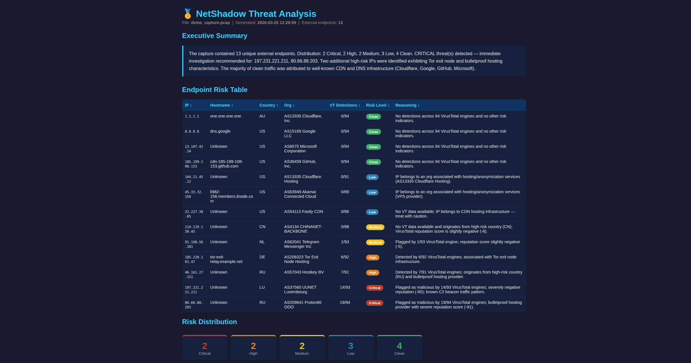

# NetShadow

A Python CLI tool for network threat analysis. Parse pcap files, capture live traffic, or run a live terminal dashboard to see every external endpoint your machine is talking to — useful for spotting unexpected beaconing or checking whether your laptop is part of a botnet.

## Demo

Open [`report_demo.html`](report_demo.html) in your browser to see a sample analysis report, or preview below:



## Features

- **analyze** — parse a `.pcap` file, enrich all external IPs via VirusTotal + ipinfo.io, score by risk, generate a standalone HTML report
- **capture** — capture live traffic to a `.pcap` file with a real-time progress bar
- **monitor** — capture + analyze in one shot; prints a risk summary to the terminal and saves an HTML report
- **dashboard** — live terminal view of all external connections: direction, hostname, country, org, bytes sent/received, protocols

## Requirements

- Python 3.10+
- `sudo` / `CAP_NET_RAW` for live capture commands (`capture`, `monitor`, `dashboard`)
- API keys for VirusTotal and ipinfo.io (optional — tool degrades gracefully without them)

## Installation

```bash
git clone https://github.com/yourname/NetShadow
cd NetShadow
pip install -r requirements.txt
cp .env.example .env   # add your API keys
```

## Usage

### Analyze an existing pcap
```bash
python netshadow.py analyze pcap/capture.pcap --output report.html
```

### Capture 60 seconds of traffic to a pcap
```bash
sudo python netshadow.py capture --duration 60 --output pcap/capture.pcap
```

### One-shot botnet check (capture → analyze → report)
```bash
sudo python netshadow.py monitor --duration 120 --output report.html
```

### Live dashboard
```bash
sudo python netshadow.py dashboard --iface eth0
```

### List available interfaces
```bash
python netshadow.py capture --list-interfaces
```

### All options

| Command     | Flag                  | Default              | Description                              |
|-------------|-----------------------|----------------------|------------------------------------------|
| `analyze`   | `pcap`                | —                    | Path to `.pcap` file (required)          |
| `analyze`   | `--output`            | `report.html`        | HTML report output path                  |
| `capture`   | `--duration`          | `60`                 | Capture duration in seconds              |
| `capture`   | `--count`             | —                    | Stop after N packets                     |
| `capture`   | `--iface`             | auto                 | Network interface                        |
| `capture`   | `--output`            | `pcap/capture.pcap`  | Output pcap path                         |
| `monitor`   | `--duration`          | `60`                 | Capture duration in seconds              |
| `monitor`   | `--count`             | —                    | Stop after N packets                     |
| `monitor`   | `--iface`             | auto                 | Network interface                        |
| `monitor`   | `--output`            | `report.html`        | HTML report output path                  |
| `monitor`   | `--save-pcap`         | —                    | Also save the raw capture to this path   |
| `dashboard` | `--iface`             | auto                 | Network interface                        |

## Live Dashboard

The dashboard sniffs traffic in real-time and updates every 500ms. Reverse DNS and ipinfo enrichment runs in a background thread and fills in as results arrive.

### Columns

| Column     | Description                                          |
|------------|------------------------------------------------------|
| Dir        | `→` outgoing · `←` incoming · `↔` both              |
| Remote IP  | External IP address                                  |
| Hostname   | Reverse DNS (resolved locally, no API needed)        |
| CC         | Country code (via ipinfo.io if token is set)         |
| Org / ASN  | Organization / ASN (via ipinfo.io if token is set)   |
| ↑ / ↓ Pkts | Packets sent / received                              |
| ↑ / ↓ Sent | Bytes sent / received                                |
| Protocols  | Top protocol/port combos seen (e.g. TCP/443, UDP/53) |

Rows are sorted by total bytes. Incoming-only connections are highlighted **yellow** — nothing was sent out but data came in, which is the main signal for unexpected C2 beaconing.

### Keyboard Shortcuts

| Key      | Action                                               |
|----------|------------------------------------------------------|
| `i`      | Toggle interface picker overlay                      |
| `1`–`9`  | Switch to interface by number (picker must be open)  |
| `r`      | Reset all stats for the current interface            |
| `q`      | Quit                                                 |
| `Ctrl+C` | Quit                                                 |

All shortcuts are shown in the status bar at the bottom of the window at all times.

### Interface Switcher

Press `i` to open the interface picker. It lists every available network interface with its IP address and marks the currently active one. Press a number to switch — the sniffer restarts and stats reset instantly.

```
╭─ Switch Interface ─────────────────────────╮
│  [1]  lo        127.0.0.1                  │
│  [2]  enp2s0    —                          │
│  [3]  wlp4s0    192.168.1.5   ◀ active     │
│  [4]  docker0   172.17.0.1                 │
╰─  press number to switch  │  [i] to close  ╯
```

## API Keys

Set these in a `.env` file (copy from `.env.example`):

| Variable              | Source                          | Effect if missing              |
|-----------------------|---------------------------------|--------------------------------|
| `VIRUSTOTAL_API_KEY`  | https://www.virustotal.com/     | VT columns show 0/0            |
| `IPINFO_TOKEN`        | https://ipinfo.io/              | Country/Org show as `Unknown`  |

> The free VirusTotal tier allows 4 requests/minute. NetShadow automatically rate-limits to stay within this.

## Scoring Logic

Rule-based, no AI API required:

| Condition                               | Risk Level |
|-----------------------------------------|------------|
| VT detections ≥ 10                      | Critical   |
| VT detections 5–9                       | High       |
| VT detections 2–4                       | Medium     |
| VT detections = 1                       | Low        |
| Reputation ≤ −50                        | Critical   |
| Reputation ≤ −20                        | High       |
| Reputation < 0                          | Medium     |
| High-risk country (CN/RU/KP/IR…)        | Medium/Low |
| Hosting / VPN / proxy ASN               | Low        |
| No VT data                              | Low        |
| No detections, no flags                 | Clean      |

## Project Structure

```
NetShadow/
├── netshadow.py       # CLI entrypoint (analyze / capture / monitor / dashboard)
├── parser.py          # pcap parsing (scapy)
├── capture.py         # live packet capture
├── dashboard.py       # live terminal dashboard
├── enricher.py        # ipinfo.io + VirusTotal enrichment
├── scorer.py          # rule-based risk scoring
├── reporter.py        # HTML report generation
├── report_demo.html   # sample report (demo data only)
├── requirements.txt
├── .env.example
└── pcap/              # put your .pcap files here (gitignored)
```
